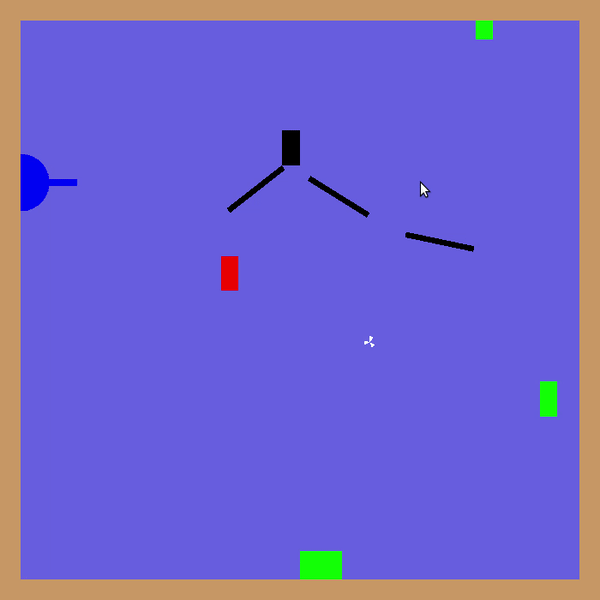

# Brick Breaker
A 2D game implemented in C++ using OpenGL 3.0

## Compile
- Compile using simple 'make'

## Run
- Run using './a.out'

## Dependencies
- Libraries
	- GLAD
	- GLFW
	- GLM
- irrKlang library is included inside the code
- Change include headers in  if needed.

## About The Game
- Score as high as possible
- 100 points to target black brick
- 100 points if you collect red/green brick in same color bucket
- -100 points if you collect red/green brick in different color bucket
- If black brick goes in any bucket game ends

## Controls

### Mouse
- Scroll up/down to zoom in and zoom out (Alternate up arrow and down arrow)
- Left click on object ('cannon,buckets') and drag to move it
- Left click on canon to move it up-down
- Left click on canon-funnel to rotate it
- Left click anywhere else to shoot
- Double left click or right click to unselect any object

### Keyboard
- 'A' to tilt cannon up
- 'D' to tilt cannon down
- 'S' to move cannon up
- 'F' to move cannon down
- 'N' to increase speed of blocks
- 'M' to decrease speed of blocks
- 'LEFT CTRL' to move red basket LEFT
- 'RIGHT CTRL' to move red basket RIGHT
- 'LEFT ALT' to move green basket LEFT
- 'RIGHT ALT' to move green basket RIGHT  
- 'SPACE' to launch bullet
- 'J' to pan scene left
- 'L' to pan scene right
- 'I' to pan scene up
- 'K' to pan scene down
- 'UP ARROW' to zoom in
- 'DOWN ARROW' to zoom out

## Bonus Features
- Background Sound, Shoot Sound, Collision Sound
- Scoreboard on Terminal
- Stylist Rotating Bullet
- Mirror Auto Up-Down and Rotation Movements

## Scope of Improvement
- Display of score on the board
